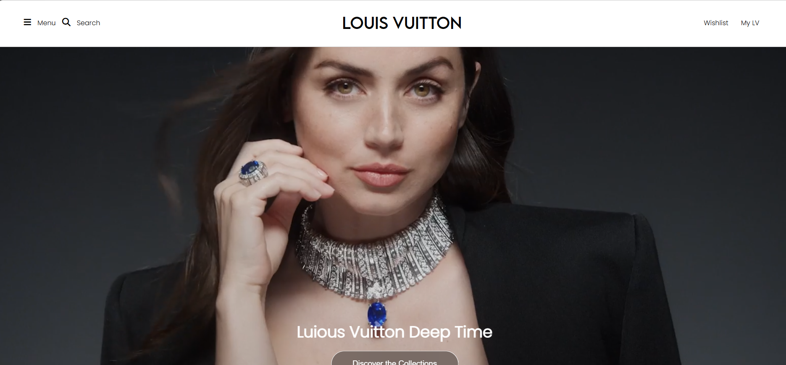
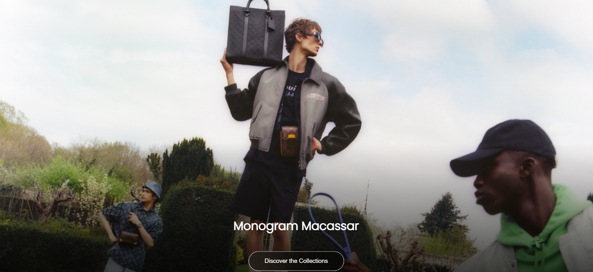
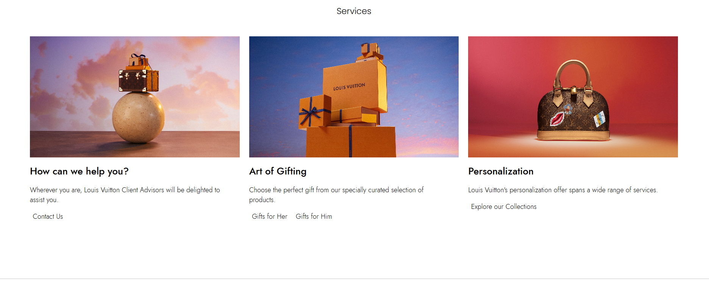

Louis Vuitton Homepage Clone

A modern and responsive frontend clone of the Louis Vuitton homepage built for learning and practice purposes. This project focuses on recreating the premium look and feel of the original website while improving frontend development skills and responsive design techniques.

## Features

- Premium and elegant homepage UI
- Fully responsive design
- Smooth scrolling and hover animations
- Modern navigation bar
- Hero banner section
- Product showcase layout
- Footer with multiple navigation links
- Clean and organized code structure

## Tech Stack

- HTML5
- CSS3
- JavaScript

## Purpose

This project was created to practice:

- Responsive web design
- Modern CSS layouts
- Frontend development best practices

## Preview

## Disclaimer

This project is created for educational and portfolio purposes only. It is not affiliated with or endorsed by Louis Vuitton. All trademarks, logos, images, and brand names belong to their respective owners.

## Author

Developed by Prabhat Singh

If you like this project, feel free to ⭐ the repository and contribute with suggestions or improvements.